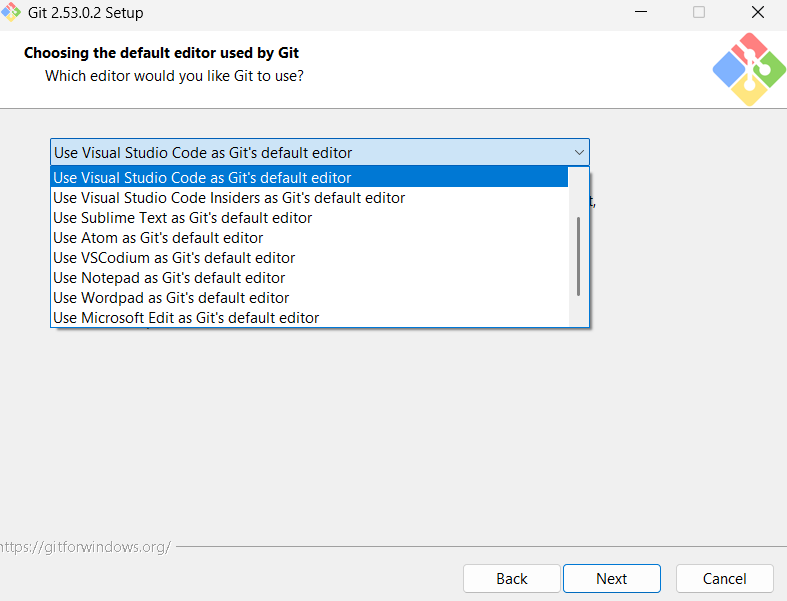
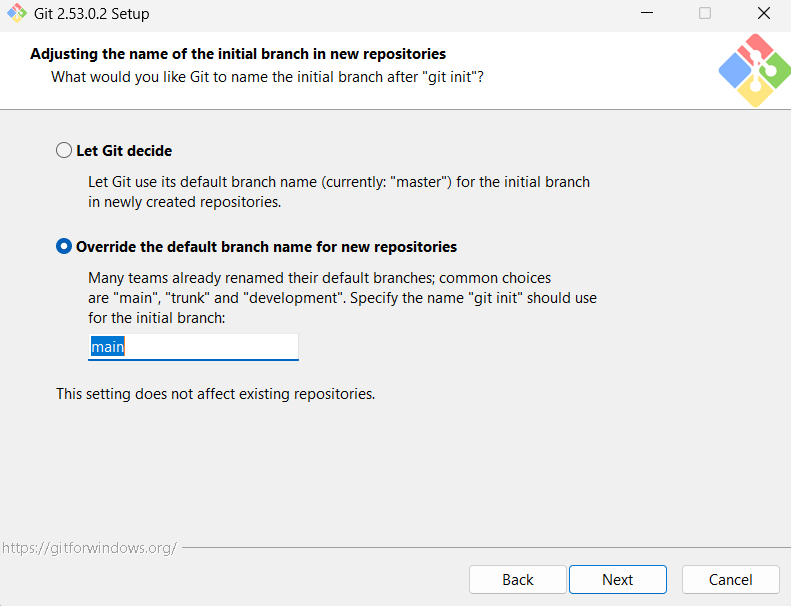
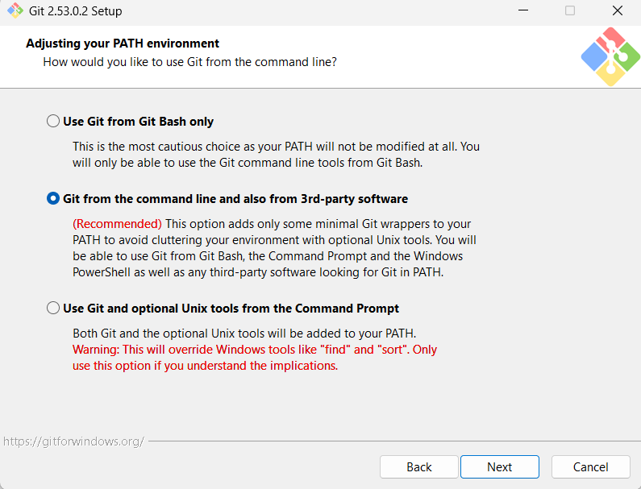
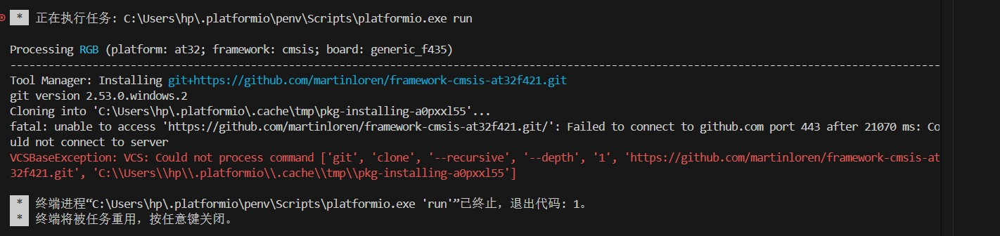
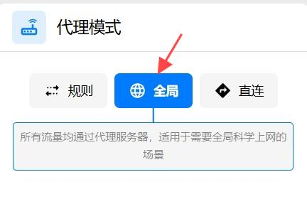
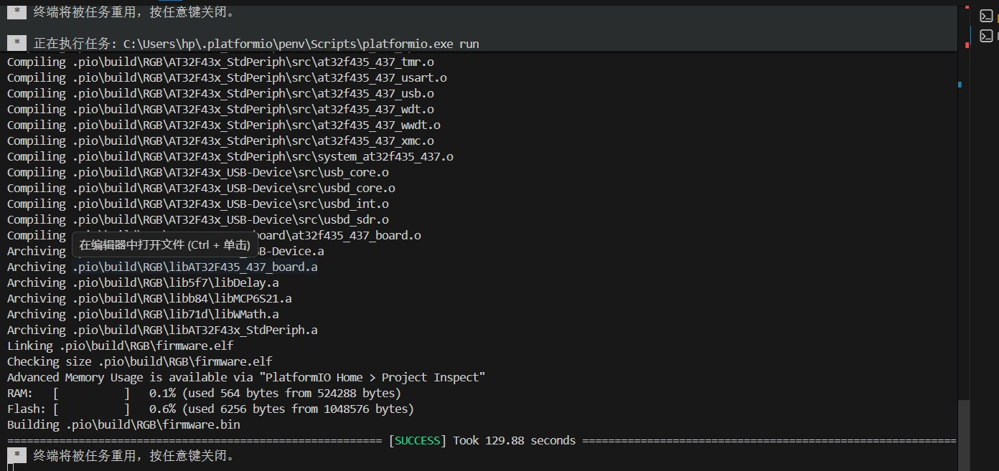

## Git-Installation 安装

Git is required to download some of the AT32 Platform required extensions.
Before proceeding, make sure Git is installed. It can be downloaded from:
 克隆这个存储库需要Git。
在继续之前，请确保安装了Git。可从以下网址下载：
[here](https://git-scm.com/downloads).
During installation, ensure that Git is added to your system PATH and properly configured. All other options can be left as default.
 在安装过程中，确保Git被添加到您的系统PATH中并被正确配置。所有其他选项都可以保留为默认值。

## Troubleshooting 使用说明

If during first time code compilation an error like the one shown below occurs (failed to connect to GitHub), it is usually caused by network issues. Please ensure that GitHub is accessible or configure a proper network proxy service for your windows machine.
 如果出现如下图所示错误（无法连接 GitHub），通常是网络问题，请确保可以访问 GitHub 或为 Git 配置代理

##### Solution:
For China Mainland users you can enable Global Mode in your Network Acceleration service software.
##### 解决方案:

The project should now compile successfully.
 项目现在可以成功编译了。

