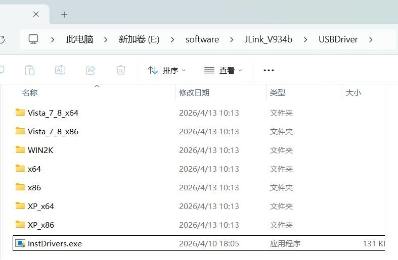

#  JLINK Installation
Before proceeding, make sure J-Link software (including JLink.exe) is installed. It can be downloaded from:[here](https://www.segger.com/downloads/jlink/)
在此之前，请确保已安装J-Link软件（包括JLink.exe）。可以从 [here](https://www.segger.com/downloads/jlink/)下载.
### J-OB Device Driver Installation 
### 说明

Open Device Manager on your PC and check whether the J-Link device is correctly recognized under "Ports (COM & LPT)". If not check the J-Link installation guide above.
 在PC上打开设备管理器，检查是否在“端口（COM & LPT）”下正确识别J-Link设备

If a warning icon (yellow exclamation mark) appears next to J-Link, it means the driver is not installed properly. In this case, go to the J-Link installation directory (for example: E:\software\JLink_V934b\USBDriver), then double-click `InstDrivers.exe` to install the driver.
 如果“J-Link”旁边出现警告图标（黄色感叹号），说明驱动安装不正确。在这种情况下，进入J-Link安装目录（例如：E:\software\JLink_V934b\USBDriver），然后双击“InstDrivers.exe”安装驱动程序。

After installation, unplug and reconnect the J-Link device.
 安装完成后，请拔出并重新连接J-Link设备。
