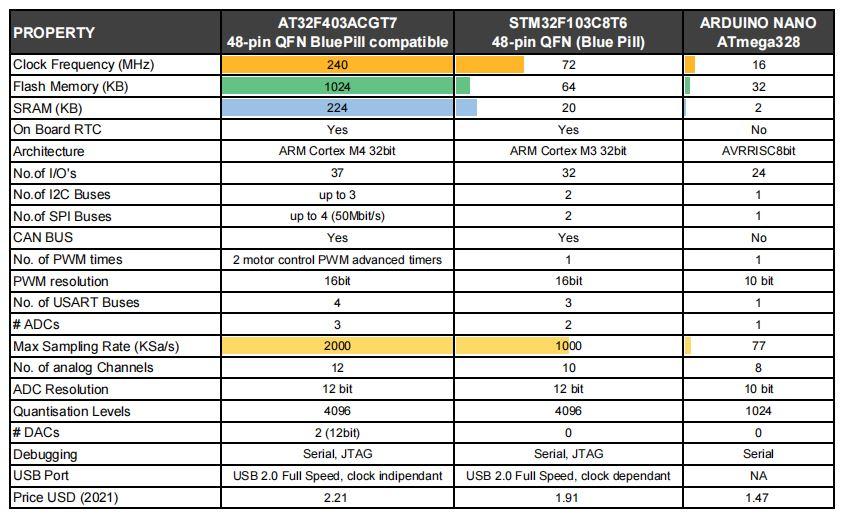
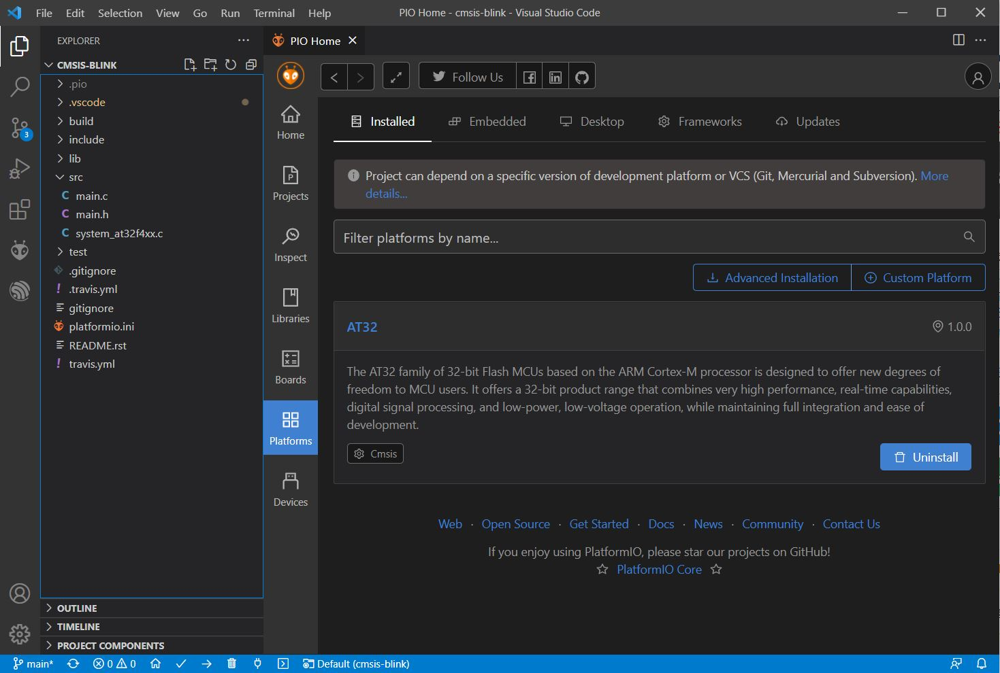
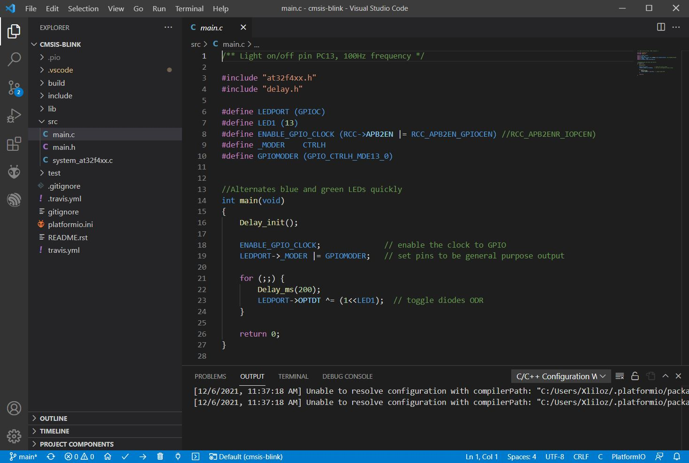
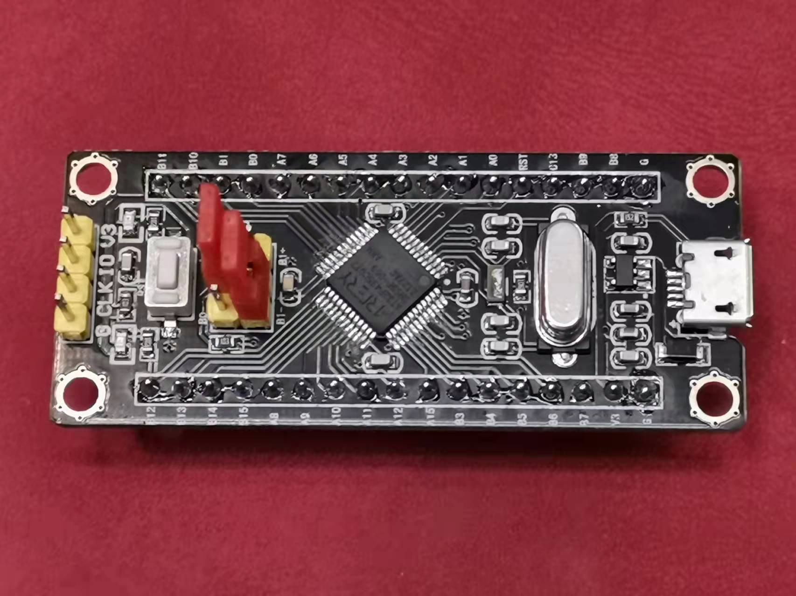

# Artery-AT32-PlatformIO
 PlatformIO platform and framework for developing the new Artery AT32 MCU. 雅特力科技AT32芯片 PlatformIO 平台和框架。

MCUs Supported: **[AT32F403A](https://www.arterychip.com/en/product/AT32F403A.jsp)**, **[AT32F435](https://www.arterychip.com/en/product/AT32F435.jsp)**, **[AT32F437](https://www.arterychip.com/en/product/AT32F437.jsp)**.
 Version 版本: 2024-12

## AT32 VS STM32

## Installation 安装
You need to have Visual Studio Code with PlatformIO installed （tested with PlatformIO Core v.6.1.16). 
1) Copy the folders under `.platformio` into your .platformio folder (ie: `C:\Users\<USER>\.platformio`)
 将 .platformio 下的文件夹复制到您的 .platformio 文件夹中（即：`C:\Users\<用户名>\.platformio`）

#### Install AT32 Configurations for J-Link (last update from ArteryICPProgrammer V3.0.19)
In order to make the J-Link software aware of the new device, copy the folder `JLinkDevices` in the the central JLinkDevices folder (Windows):	`C:\Users\<USER>\AppData\Roaming\SEGGER\`

Currently available:
- AT32F435xGx
- AT32F437xGx

More details about custom device configuration for J-Link are available [here](https://wiki.segger.com/J-Link_Device_Support_Kit).

## Usage Instructions 使用说明
3) Open Visual Studio Code, you should see AT32 Platform among the available platforms
 打开 Visual Studio Code，在可用平台中应该可以看到 AT32 平台
1) Open one of the example folder and try to compile / upload
 打开示例文件夹之一并尝试编译代码/上传到 MCU

# Upload Firmware on MCU 上传固件
Available upload methods: `serial bootloader` (PA9, PA10), `dfu`, `jlink` (check the configuration guide [here](https://github.com/martinloren/Artery-AT32-PlatformIO/blob/main/JLINK.md) ) 
可用的上传方法：串行引导加载程序（PA9、PA10）、dfu、jlink
1) Set it in the file `platformio.ini` in the Project folder, complete configuration options as in example project *cmsis-blink* 
设置在项目文件夹的platformio.ini文件中，完整的配置选项在示例项目*cmsis-blink*中
2) Run the Upload 
运行上传

Notes 备注: 
1) Serial bootloader speed seems to work up to 115200 (at higher speed it often doesn't work) 
串行引导加载程序的速度似乎可以达到 115200（在更高的速度下通常不起作用）
2) Serial bootloader works only when USB port is disconnected (otherwise the MCU starts in DFU mode). So, in case you put this MCU on a Bluepill PCB, you need to power the MCU from 5V or 3V3 pin and not with USB cable. 
串行引导加载程序仅在 USB 端口断开连接时工作（否则 MCU 以 DFU 模式启动）。 因此，如果您将此 MCU 放在 Bluepill PCB 上，则需要从 5V 或 3V3 引脚而不是 USB 电缆为 MCU 供电。

# Supported 支持
- Hardware Floating point unit (FPU) 
硬件浮点单元 (FPU)
- C/C++ compilation 
C/C++ 编译
- 224K Max SRAM (for AT32F403A) 
224K 最大SRAM (AT32F403A)

# TO-DO List 待办事项清单
- none

# Screenshots 屏幕截图

# Available Examples
**AT32F435**
- LED Blink
- USB vcp loopback
- ADC Vref value check

**AT32F403A**
- LED BLink

# AT32F403A on Bluepill PCB - 在 Bluepill PCB 上使用 AT32F403A
You can replace the MCU on the Bluepill board with the AT32F403A. It is pin fully compatible.
Just need to replace BOOT0 resistor from the present value of 100K with the value of 10K. This will allow the MCU to enter in Bootloader mode and flash it via UART1. 
你可以用 AT32F403A 替换 Bluepill 板上的 MCU。 它是引脚完全兼容的。
只需要将BOOT0电阻从现在的100K值换成10K的值即可。 这将允许 MCU 进入引导加载程序模式并通过 UART1 对其进行闪存。

# AT32F435 on Blackpill PCB
You can mount the AT32F435 on the [Blackpill PCB](https://item.taobao.com/item.htm?spm=a230r.1.14.44.458014682yTbFh&id=661526858750&ns=1&abbucket=11#detail) for STM32F103. It works without any other modification requied.

