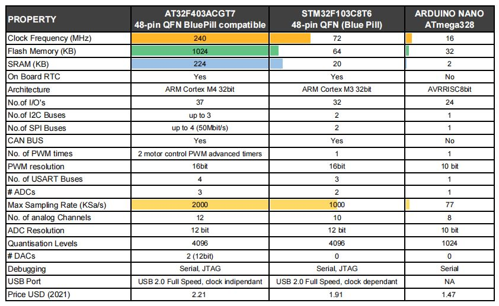
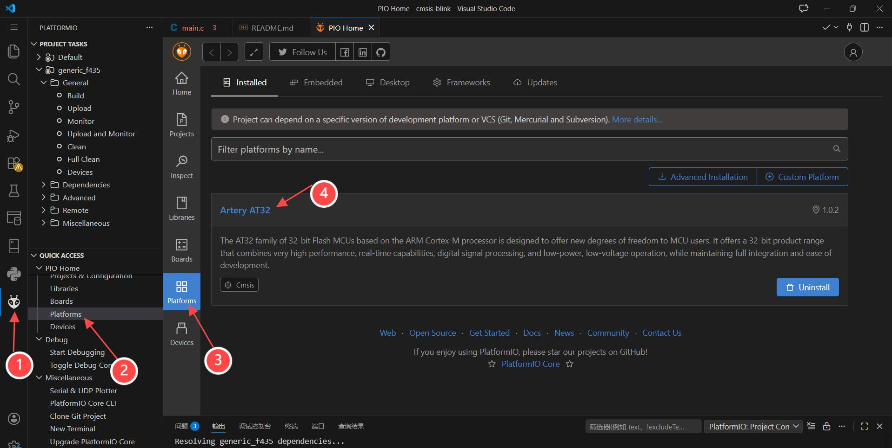
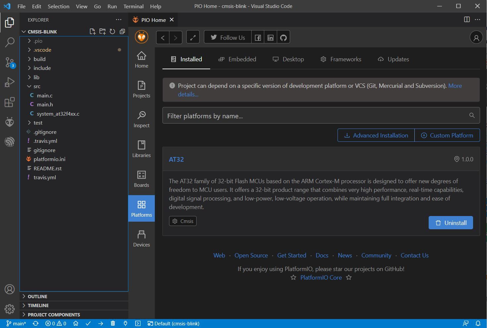
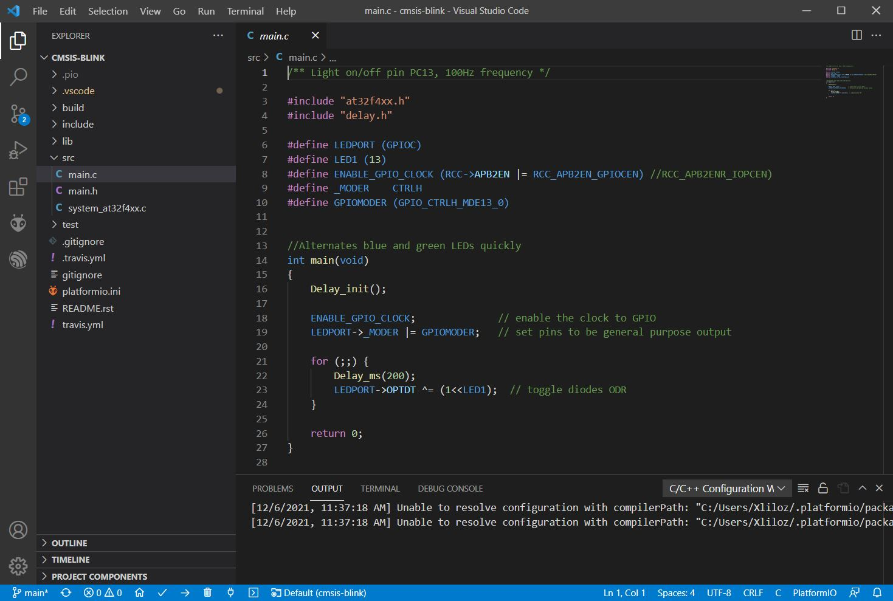
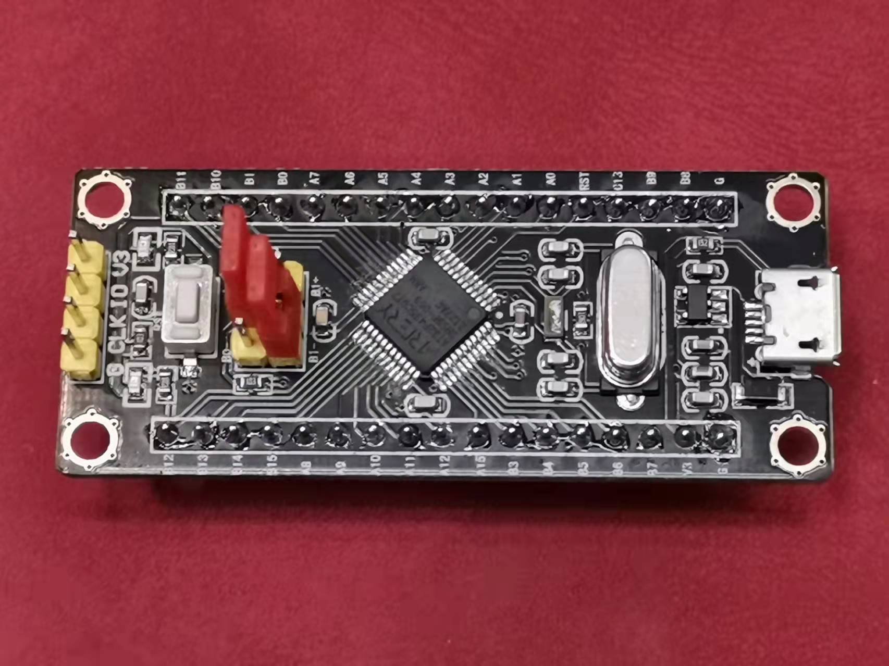

# Artery-AT32-PlatformIO
 PlatformIO platform and framework for developing the new Artery AT32 MCU under VS Code!<br/>雅特力科技AT32芯片 PlatformIO 平台和框架。

MCUs Supported: **[AT32F403A](https://www.arterychip.com/en/product/AT32F403A.jsp)**, **[AT32F435](https://www.arterychip.com/en/product/AT32F435.jsp)**, **[AT32F437](https://www.arterychip.com/en/product/AT32F437.jsp)**.
<br/>Version 版本: 2026-03

## AT32 VS STM32

## Prerequisites 前置条件
Before using this framework, make sure the following tools are installed:

- Visual Studio Code + PlatformIO ([Installation Guide](./VSCode-README.md))
- Git ([Installation Guide](./GIT-README.md))
- J-Link (for firmware upload and debugging) ([Installation Guide](./JLINK-README.md))

在使用本项目之前，请确保已安装以下工具：

- Git（用于克隆本仓库）([安装指南](./GIT-README.md))
- Visual Studio Code + PlatformIO ([安装指南](./VSCode-README.md))
- J-Link (for firmware upload and debugging)  ([安装指南](./JLINK-README.md))

## Installation 安装
#### 1. Install AT32 Platform in PlatformIO
#### 在PlatformIO中安装平台（AT32 MCU平台）
 1.Copy the folders under `.platformio` into your .platformio folder (ie: `C:\Users\<USER>\.platformio`)
<br/>将 .platformio 下的文件夹复制到您的 .platformio 文件夹中（即：`C:\Users\<用户名>\.platformio`）

Restart VS Code, then go to PlatformIO → Platforms and check whether the target chip platform has been installed correctly. If it appears as shown below, the installation is successful.
<br/>重启VS Code，然后进入PlatformIO→Platforms，检查目标芯片平台是否已经正确安装。如果出现如下所示，则说明安装成功。


#### 2. Install AT32 Configurations for J-Link (last update from ArteryICPProgrammer V3.0.19)
#### 为J-Link安装AT32配置（最近更新自ArteryICPProgrammer V3.0.19）

Before proceeding, make sure J-Link software (including JLink.exe) is installed.
In order to let the J-Link software work with AT32 MCUs under PlatformIO, copy the folder `JLinkDevices` in the the main JLinkDevices folder (Windows):	
`C:\Users\<USER>\AppData\Roaming\SEGGER\`
<br>在此之前，请确保已安装J-Link软件（包括JLink.exe）。
为了让J-Link软件在PlatformIO下与AT32 mcu一起工作，请复制主JLinkDevices文件夹中的文件夹'JLinkDevices' （Windows）:
`C:\Users\<USER>\AppData\Roaming\SEGGER\`
If the SEGGER folder does not exists, create it. 
<br>为了使J-Link软件能够识别新设备，请复制中央JLinkDevices文件夹（Windows）中的“JLinkDevices”文件夹：“C:\Users\<USER> \AppData\Roaming\SEGGER\”。

Currently available:
目前可用：
- AT32F435xGx
- AT32F437xGx

More details about custom device configuration for J-Link are available [here](https://wiki.segger.com/J-Link_Device_Support_Kit).
有关J-Link的自定义设备配置的更多详细信息可供参考[here](https://wiki.segger.com/J-Link_Device_Support_Kit).


# First Project
1. Copy one of the available sample folder to make a new project.
2. Open the copied folder in VS Code and wait that the PlatformIO Extension starts.
3. Hit the Build button and check that the building succeed.


## Info about Platform.ini Project Configuration File
```
[env:(write here project name)]
platform = at32
framework = cmsis
board = generic_f435 ;or: generic_f403a
build_flags = -I include
monitor_speed = 921600 
upload_protocol = jlink ;or: serial
debug_tool = jlink
```


## Upload Firmware on MCU 上传固件
Available upload methods: `serial bootloader` (PA9, PA10), `dfu`, `jlink` (check the configuration guide [here](https://github.com/martinloren/Artery-AT32-PlatformIO/blob/main/JLINK.md) )<br>
可用的上传方法：串行引导加载程序（PA9、PA10）、dfu、jlink
1) Set it in the file `platformio.ini` in the Project folder, complete configuration options as in example project *cmsis-blink*<br>
设置在项目文件夹的platformio.ini文件中，完整的配置选项在示例项目*cmsis-blink*中
2) Run the Upload<br>
运行上传

Notes 备注: 
1) Serial bootloader speed seems to work up to 115200 (at higher speed it often doesn't work)<br>
串行引导加载程序的速度似乎可以达到 115200（在更高的速度下通常不起作用）
2) Serial bootloader works only when USB port is disconnected (otherwise the MCU starts in DFU mode). So, in case you put this MCU on a Bluepill PCB, you need to power the MCU from 5V or 3V3 pin and not with USB cable.<br>
串行引导加载程序仅在 USB 端口断开连接时工作（否则 MCU 以 DFU 模式启动）。 因此，如果您将此 MCU 放在 Bluepill PCB 上，则需要从 5V 或 3V3 引脚而不是 USB 电缆为 MCU 供电。

# Supported 支持
- Hardware Floating point unit (FPU)<br>
硬件浮点单元 (FPU)
- C/C++ compilation<br>
C/C++ 编译
- 224K Max SRAM for AT32F403 / 512K for AT32F435<br>
224K 最大SRAM为AT32F403，512K为AT32F435

# TO-DO List 待办事项清单
- none

# Screenshots 屏幕截图



# Available Examples
**AT32F437**
- LED Blink

**AT32F435**
- LED Blink
- USB vcp loopback
- ADC Vref value check

**AT32F403A**
- LED BLink

# AT32F403A on Bluepill PCB - 在 Bluepill PCB 上使用 AT32F403A
You can replace the MCU on the Bluepill board with the AT32F403A. It is pin fully compatible.
Just need to replace BOOT0 resistor from the present value of 100K with the value of 10K. This will allow the MCU to enter in Bootloader mode and flash it via UART1.<br>
你可以用 AT32F403A 替换 Bluepill 板上的 MCU。 它是引脚完全兼容的。
只需要将BOOT0电阻从现在的100K值换成10K的值即可。 这将允许 MCU 进入引导加载程序模式并通过 UART1 对其进行闪存。

# AT32F435 on Blackpill PCB
You can mount the AT32F435 on the [Blackpill PCB](https://item.taobao.com/item.htm?spm=a230r.1.14.44.458014682yTbFh&id=661526858750&ns=1&abbucket=11#detail) for STM32F103. It works without any other modification requied.



