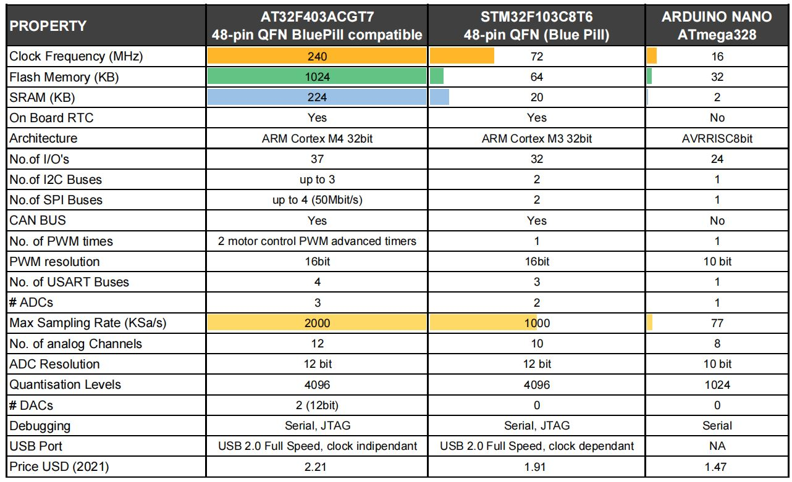

# Artery-AT32-PlatformIO
 PlatformIO platform and framework for Artery AT32 MCU.

Released specifically for the latest [AT32F403A MCU](https://www.arterychip.com/en/product/AT32F403A.jsp) with Visual Studio Code & PlatformIO.

## Why ST32F403A

## Instructions
1) Copy the folders under .platformio into your .platformio folder (ie: C:\Users\(username)\.platformio)
2) Open Visual Studio Code, you should see AT32 Platform among the available platforms
3) Open one of the example folder and try to compile / upload

# Upload on MCU
Available upload methods: serial bootloader (PA9, PA10), dfu
1) Set it in the file platformio.ini in the project folder, complete configuration options as in example project *cmsis-blink*
2) Run the Upload

Notes: 
1) Serial bootloader speed seems to work up to 115200 (at higher speed it often doesn't work)
2) Serial bootloader works only when USB port is disconnected (otherwise the MCU starts in DFU mode). So, in case you put this MCU on a Bluepill PCB, you need to power the MCU from 5V or 3V3 pin and not with USB cable.

# Supported
- Hardware Floating point unit (FPU)
- C/C++ compilation

# TO-DO List
- Add more examples (USB)
- Provide Bluepill board example?

# AT32F403A on Bluepill PCB
You can replace the MCU on the Bluepill board with the AT32F403A. It is pin fully compatible.
Just need to replace BOOT0 resistor from the present value of 100K with the value of 10K. This will allow the MCU to enter in Bootloader mode and flash it via UART1.

# Screenshots

