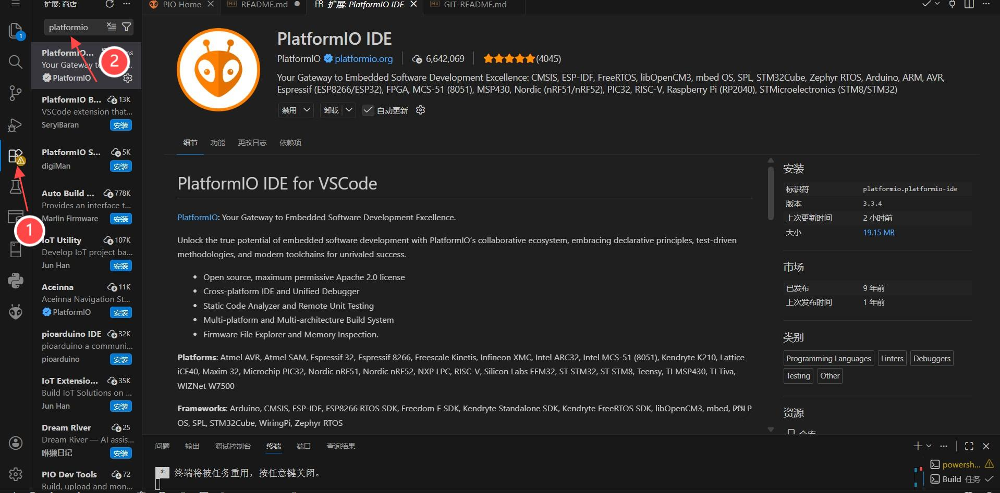

## VS Code PlantformIO Installation 安装

1. Install Visual Studio Code and PlatformIO  
   (tested with PlatformIO Core v6.1.16).  
    安装 Visual Studio Code 并安装 PlatformIO（基于 PlatformIO Core v6.1.16 测试）。

   Download VS Code from:  
   https://code.visualstudio.com/

2. After installing Visual Studio Code, install the PlatformIO extension.
The installation steps are shown below:  
    安装 Visual Studio Code 后，请安装 PlatformIO 扩展。
   安装步骤如图所示：

